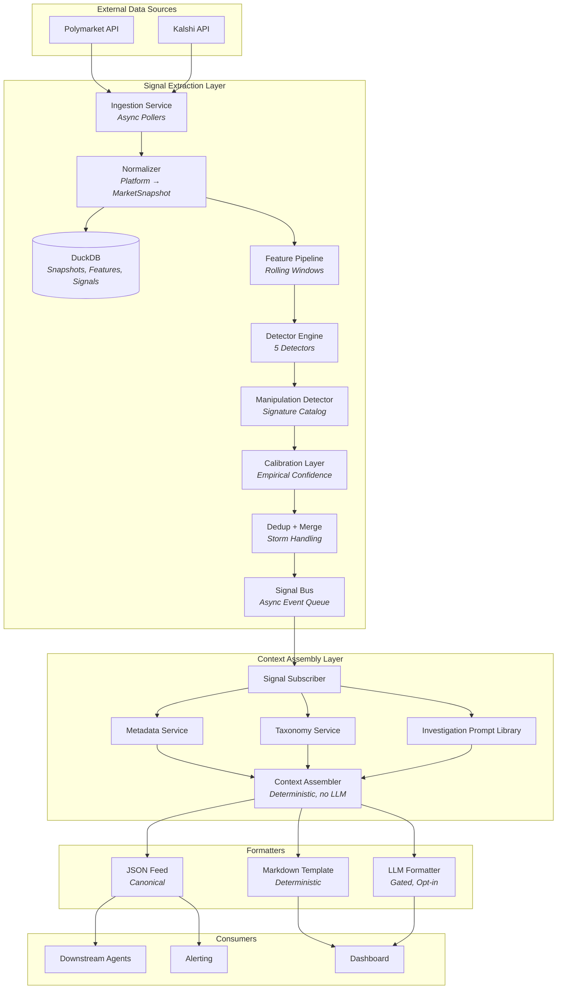
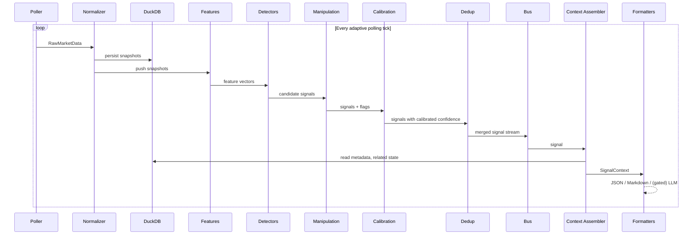

# System Design

This document is the authoritative architecture description for Augur. Layer-by-layer behavior, repository structure, storage schema, workflows, and configuration live here. Algorithmic detail for the calibration and manipulation layers lives in `../methodology/calibration-methodology.md` and `../methodology/manipulation-taxonomy.md`. The polling state machine, signal merging, and storage scaling decisions are split into their own files in this directory.

## High-Level Architecture



The diagram reflects the deterministic-context-primary architecture. The LLM formatter is one of three formatters, all consuming the same `SignalContext`. The canonical machine-consumed output is `FJSON`. The LLM formatter exists for human channels and is gated.

## Repository Structure

```text
augur/
├── pyproject.toml                  # uv workspace root (v0.1.0)
├── README.md
├── config/
│   ├── bus.toml                    # phase 5 — message bus backend selector
│   ├── storage.toml                # phase 5 — DuckDB / TimescaleDB selector
│   ├── observability.toml          # phase 5 — Prometheus + OTel exporters
│   ├── llm.toml                    # phase 4 — gated LLM formatter
│   ├── polling.toml
│   ├── detectors.toml
│   ├── dedup.toml
│   ├── formatters.toml
│   ├── consumers.toml
│   ├── labeling.toml
│   ├── markets.toml
│   └── forbidden_tokens.toml
├── data/
│   ├── markets/
│   ├── investigation_prompts.toml
│   └── calibration/
├── labels/
│   └── newsworthy_events.parquet
├── src/
│   ├── augur_signals/
│   │   ├── models/                 # MarketSnapshot, FeatureVector, MarketSignal, enums
│   │   ├── ingestion/              # Pollers, normalizer
│   │   ├── features/               # Rolling-window feature pipeline
│   │   ├── detectors/              # 5 detectors + base protocol
│   │   ├── manipulation/           # Signature catalog + evaluator
│   │   ├── calibration/            # FPR, BH-FDR, reliability curves, drift, FDR controller
│   │   ├── context/                # Deterministic context assembler
│   │   ├── storage/                # DuckDB + TimescaleDB adapters (phase 5)
│   │   ├── bus/                    # EventBus protocol + NATS + Redis + distributed lock (phase 5)
│   │   ├── workers/                # Harness, singleton runner, bootstrap (phase 5)
│   │   ├── dedup/                  # Signal dedup + storm handling
│   │   └── engine.py               # Monolith orchestrator
│   ├── augur_labels/               # Labeling pipeline (phase 2)
│   └── augur_format/
│       ├── deterministic/          # JSON, Markdown, webhook, websocket (phase 3)
│       └── llm/                    # Gated LLM formatter (phase 4)
├── tests/
├── scripts/
│   ├── backtest.py                 # stub
│   ├── calibrate.py                # stub
│   ├── export_schemas.py
│   ├── label.py
│   ├── lint_detector_now.py
│   ├── migrate_to_timescale.py     # phase 5 — backfill + verify
│   └── dual_write_sidecar.py       # phase 5 — tee replay
└── ops/
    ├── docker/                     # Dockerfile + local smoke compose stack
    │   ├── Dockerfile
    │   ├── compose.yaml
    │   ├── prometheus.yml
    │   ├── otel-collector.yaml
    │   └── config/                 # smoke-specific bus/storage/observability TOMLs
    └── deploy/                     # Kubernetes manifests (Deployments, StatefulSets, HPA, Services)
```

The `src/augur_signals/` package contains zero LLM imports. CI enforces this via grep. The `src/augur_format/llm/` package is the only location where LLM code lives; it is gated behind `interpretation_mode = LLM_ASSISTED` and is opt-in per consumer.

## Layer 1 — Ingestion

Async pollers per platform implement a common interface:

```python
class AbstractPoller(Protocol):
    async def poll_markets(self) -> list[RawMarketData]: ...
    async def poll_orderbook(self, market_id: str) -> RawOrderBook | None: ...
    async def poll_trades(self, market_id: str, since: datetime) -> list[RawTrade]: ...
    def platform_id(self) -> str: ...
```

Polling cadence is per-market and adaptive. The state machine is in `./adaptive-polling-spec.md`. Platform rate limits are budgeted in that document; the engine enforces backoff on rate-limit responses with exponential delay capped at 5 retries.

## Layer 2 — Feature Pipeline

The pipeline maintains a per-market snapshot buffer (default 500 snapshots, ≈ 4 hours at 30 s polling) and computes a `FeatureVector` per polling tick. The feature schema is in `../contracts/schema-and-versioning.md`. Computation is idempotent — given the same buffer, the same `FeatureVector` is produced, enabling exact replay in backtests.

| Feature                   | Computation                                             |
| ------------------------- | ------------------------------------------------------- |
| `price_momentum_<window>` | `(price_now - price_window_start) / price_window_start` |
| `volatility_<window>`     | Standard deviation of price returns in window           |
| `volume_ratio_<window>`   | Window volume divided by 7-day EWMA baseline (α = 0.05) |
| `bid_ask_ratio`           | `bid_depth / (bid_depth + ask_depth)` over top 5 levels |
| `spread_pct`              | `(ask - bid) / midpoint`                                |

The EWMA baseline is halt-aware: when a polling gap exceeds twice the configured interval, the EWMA update applies a decay correction, preventing baseline drift from masking post-halt activity.

## Layer 3 — Detectors

Five detectors run against the feature stream. Each implements a common protocol:

```python
class SignalDetector(Protocol):
    detector_id: str
    signal_type: SignalType
    def warmup_required(self) -> int: ...
    def ingest(self, market_id: str, feature: FeatureVector, now: datetime) -> MarketSignal | None: ...
    def state_dict(self, market_id: str) -> dict: ...
    def load_state(self, market_id: str, state: dict) -> None: ...
    def reset(self, market_id: str) -> None: ...
```

`now` is a parameter, never sourced from `datetime.now()` inside detector code. This is required for replay determinism in backtests.

| Detector                | Method                                        | Key Parameters                                                                      |
| ----------------------- | --------------------------------------------- | ----------------------------------------------------------------------------------- |
| Price Velocity          | Beta-Binomial BOCPD                           | hazard 1/250; fire threshold P(r_t < 5) > 0.7; resolution exclusion 6 h             |
| Volume Spike            | EWMA z-score with FDR-controlled threshold    | EWMA α = 0.05; target FDR q = 0.05; min volume floor per platform                   |
| Book Imbalance          | Bid/ask depth ratio with hysteresis           | top 5 levels; bullish > 0.72, bearish < 0.28; persist 3 snapshots; min depth $5,000 |
| Cross-Market Divergence | Spearman rank + Fisher-z + Benjamini-Hochberg | window 4 h; min historical correlation 0.6; activity floor volume_ratio > 1.0       |
| Regime Shift            | Two-sided CUSUM on volatility                 | target α = 0.02; k = 0.5σ; h = 4σ; min dormancy 6 h; adaptive cooldown              |

Threshold derivation, FDR control, and per-detector confidence calibration are described in `../methodology/calibration-methodology.md`. Implementation detail (file layout, test harness) is internal scaffolding and not in scope here.

Each detector excludes signals within six hours of the market's `closes_at`. The exclusion is enforced inside `ingest()`; a signal in the pre-resolution window is never returned, regardless of magnitude.

## Layer 4 — Manipulation Detection

Every signal produced by Layer 3 passes through the manipulation detector before reaching Layer 5. The detector evaluates the signature catalog from `../methodology/manipulation-taxonomy.md` against the trades, book events, and snapshots surrounding the signal, and attaches a `manipulation_flags` list to the signal. The list is always present and may be empty.

The detector does not suppress signals based on flag matches. Suppression is the consumer's policy decision per `../methodology/manipulation-taxonomy.md`.

## Layer 5 — Calibration

The calibration layer assigns the `confidence` field to every signal. The methodology is in `../methodology/calibration-methodology.md`. The layer requires a populated `calibration_fpr` table and a current reliability curve per detector; signals emitted without a calibration provenance stamp fail validation at the schema boundary.

Tier-conditional reliability curves are looked up by `(detector_id, liquidity_tier)`. The signal's `liquidity_tier` is derived from the 7-day rolling volume window per the bands in `../foundations/glossary.md`.

## Layer 6 — Deduplication and Storm Handling

Multiple detectors firing on the same market within a short window, or correlated signals across taxonomy-related markets, are merged before reaching the bus. The merge algorithm and storm-mode behavior are in `./deduplication-and-storms.md`. The bus never receives raw per-detector emissions; it always receives the post-merge stream.

## Layer 7 — Signal Bus

The bus is an async in-process queue in the MVP single-process deployment, with a documented migration path to NATS or Redis Streams in the multi-process deployment. The interface is small:

```python
class EventBus(Protocol):
    async def publish(self, signal: MarketSignal) -> None: ...
    async def subscribe(self) -> AsyncIterator[MarketSignal]: ...
```

Bus capacity, drop policy, and storm-mode behavior are governed by `./deduplication-and-storms.md`.

## Layer 8 — Context Assembly

The context assembler subscribes to the bus and produces a `SignalContext` per `MarketSignal`. The assembler is deterministic — same inputs always produce byte-identical output. It performs three lookups:

1. Market metadata (question, resolution criteria, resolution source, closes_at) from the snapshot store.
2. Related-market state from the curated taxonomy and the snapshot store.
3. Investigation prompts from the frozen `InvestigationPromptLibrary` keyed by `(signal_type, market_category)`.

The assembler never invokes an LLM. It never synthesizes prose. It is a fact-router. The `SignalContext` schema is in `../contracts/schema-and-versioning.md`.

## Formatters

Three formatters consume `SignalContext`:

| Formatter         | Output                                                        | When Used                                     |
| ----------------- | ------------------------------------------------------------- | --------------------------------------------- |
| JSON Feed         | Canonical `SignalContext` JSON                                | Default for all agent consumers               |
| Markdown Template | Deterministic Markdown via Jinja2; no LLM                     | Default for human-readable channels           |
| LLM Formatter     | `IntelligenceBrief` with `interpretation_mode = LLM_ASSISTED` | Gated, opt-in; human channels only by default |

The LLM formatter is declared in the contract for completeness but is not part of the deterministic pipeline. It is implementation-gated behind `interpretation_mode = LLM_ASSISTED` and enforces a forbidden-token vocabulary at emission time. A brief that fails the forbidden-token check is dropped and never reaches the bus.

The closed `ConsumerType` enum in `../contracts/consumer-registry.md` constrains every `actionable_for` value any formatter emits.

## Storage Schema

DuckDB tables. Partitioning strategy and migration triggers are in `./storage-and-scaling.md`.

```sql
-- Raw normalized snapshots
CREATE TABLE snapshots (
    market_id     VARCHAR NOT NULL,
    platform      VARCHAR NOT NULL,
    timestamp     TIMESTAMP NOT NULL,
    last_price    DOUBLE,
    bid           DOUBLE,
    ask           DOUBLE,
    spread        DOUBLE,
    volume_24h    DOUBLE,
    liquidity     DOUBLE,
    question      VARCHAR,
    resolution_source VARCHAR,
    resolution_criteria VARCHAR,
    closes_at     TIMESTAMP,
    raw_json      JSON,
    schema_version VARCHAR NOT NULL,
    PRIMARY KEY (market_id, platform, timestamp)
);

-- Computed features
CREATE TABLE features (
    market_id     VARCHAR NOT NULL,
    computed_at   TIMESTAMP NOT NULL,
    payload       JSON NOT NULL,
    schema_version VARCHAR NOT NULL,
    PRIMARY KEY (market_id, computed_at)
);

-- Detected signals (post-calibration, post-dedup)
CREATE TABLE signals (
    signal_id     VARCHAR PRIMARY KEY,
    market_id     VARCHAR NOT NULL,
    platform      VARCHAR NOT NULL,
    signal_type   VARCHAR NOT NULL,
    magnitude     DOUBLE NOT NULL,
    direction     INTEGER NOT NULL,
    confidence    DOUBLE NOT NULL,
    fdr_adjusted  BOOLEAN NOT NULL,
    detected_at   TIMESTAMP NOT NULL,
    window_seconds INTEGER NOT NULL,
    liquidity_tier VARCHAR NOT NULL,
    related_market_ids VARCHAR[],
    raw_features  JSON NOT NULL,
    schema_version VARCHAR NOT NULL
);

-- Manipulation flag attachments (one row per (signal, flag) pair)
CREATE TABLE manipulation_flags (
    signal_id     VARCHAR NOT NULL,
    flag          VARCHAR NOT NULL,
    detected_at   TIMESTAMP NOT NULL,
    PRIMARY KEY (signal_id, flag)
);

-- Empirical FPR per (detector, market)
CREATE TABLE calibration_fpr (
    detector_id   VARCHAR NOT NULL,
    market_id     VARCHAR NOT NULL,
    fpr           DOUBLE NOT NULL,
    sample_size   INTEGER NOT NULL,
    computed_at   TIMESTAMP NOT NULL,
    label_protocol_version VARCHAR NOT NULL,
    PRIMARY KEY (detector_id, market_id, computed_at)
);

-- Reliability curves per (detector, liquidity_tier)
CREATE TABLE reliability_curves (
    detector_id   VARCHAR NOT NULL,
    liquidity_tier VARCHAR NOT NULL,
    curve_version VARCHAR NOT NULL,
    deciles       JSON NOT NULL,
    built_at      TIMESTAMP NOT NULL,
    PRIMARY KEY (detector_id, liquidity_tier, curve_version)
);

-- Signal-to-event labels (joined with newsworthy_events.parquet at backtest time)
CREATE TABLE signal_labels (
    signal_id     VARCHAR NOT NULL,
    event_id      VARCHAR,
    label         VARCHAR NOT NULL,    -- 'true_positive' | 'false_positive' | 'true_negative'
    lead_time_seconds INTEGER,
    labeled_at    TIMESTAMP NOT NULL,
    label_protocol_version VARCHAR NOT NULL,
    PRIMARY KEY (signal_id)
);
```

## End-to-End Workflow



## Backtesting

The backtest harness replays historical snapshots from DuckDB through the same code paths the live pipeline uses. Replay determinism depends on:

1. `now` being threaded through every detector as a parameter (see Layer 3).
2. Adaptive polling intervals being recorded with each snapshot so replay can re-derive the same tick sequence.
3. Calibration curves being version-pinned at replay time so a backtest reproduces the calibrated confidence active at the original signal time.

Backtest evaluation against the labeled corpus uses the rules in `../methodology/labeling-protocol.md`. Precision, recall, and lead-time distributions are computed per detector and per liquidity tier.

## Configuration

### `config/default.toml`

Engine-wide settings: bus capacity, storage paths, polling defaults, retry policy, feature flags.

### `config/markets.toml`

The watchlist. Each market entry includes a category that keys the investigation prompt library.

```toml
[[markets]]
id = "kalshi_fed_rate_june_2026"
platform = "kalshi"
platform_market_id = "FED-RATE-CUT-JUN26"
category = "monetary_policy"
active = true
poll_priority = "high"

[[markets]]
id = "polymarket_invasion_xy"
platform = "polymarket"
platform_market_id = "0x1234abcd..."
category = "geopolitics"
active = true
poll_priority = "normal"

[[relationships]]
market_a = "kalshi_fed_rate_june_2026"
market_b = "kalshi_fed_holds_2026"
type = "inverse"
strength = 0.9
source = "manual"
```

The `category` field is mandatory and must match a category in the routing table in `../contracts/consumer-registry.md`. Markets with unknown categories fall through to `dashboard`-only routing.

### `config/detectors.toml`

Per-detector parameters: hazard rates, EWMA alphas, thresholds (pre-calibration), window sizes, cooldowns, dormancy minimums, depth floors. The full schema is in the implementation; consumers do not interact with this file.

### `config/forbidden_tokens.toml`

The closed list of phrase strings the LLM formatter rejects. Maintained as a configuration file so the documentation can describe the categories without enumerating the literal phrases.

## Technology Decisions

| Decision                     | Choice                    | Rationale                                                                                      |
| ---------------------------- | ------------------------- | ---------------------------------------------------------------------------------------------- |
| Language                     | Python 3.12+              | Async ecosystem, numpy/scipy/pydantic, suitable for both detectors and the gated LLM formatter |
| Data models                  | Pydantic v2 frozen models | Validation, JSON schema export, immutability for replay determinism                            |
| Async HTTP                   | aiohttp                   | Mature, connection pooling, no heavy framework                                                 |
| Storage (Phase 1)            | DuckDB embedded           | Columnar, zero-ops, suitable up to the migration trigger in `./storage-and-scaling.md`         |
| Statistics                   | numpy + scipy             | Beta-Binomial BOCPD, CUSUM, EWMA, Spearman, Fisher-z                                           |
| Local LLM (Phase 4)          | Ollama                    | Gemma class models on consumer GPUs; opt-in only                                               |
| Cloud LLM (Phase 4 fallback) | Anthropic API             | Higher-quality interpretation when local insufficient; opt-in only                             |
| Configuration                | TOML                      | Human-readable for the watchlist and detector parameters                                       |
| Testing                      | pytest + hypothesis       | Property-based tests for detector invariants                                                   |
| Packaging                    | uv + pyproject.toml       | Fast resolution, workspace support                                                             |

## Key Constraints

1. **No LLM in the signal extraction path.** The `src/augur_signals/` package contains zero LLM imports. CI enforces this via `grep -r 'anthropic\|openai\|ollama\|llama' src/augur_signals/`.
2. **Detectors are stateful but serializable.** Per-market state survives process restarts via `state_dict()` and `load_state()`. Cold-start blackout is the warmup window per detector; replay-on-startup uses recent snapshots from DuckDB to shorten the blackout.
3. **Feature computation is idempotent.** Same buffer in, same vector out. Backtest fidelity depends on this.
4. **The signal schema is the contract.** `MarketSignal` and `SignalContext` are the boundaries between layers. Each layer can evolve independently while the schemas hold.
5. **Polling, not streaming.** Neither Polymarket nor Kalshi exposes reliable WebSocket feeds. The system uses adaptive polling per `./adaptive-polling-spec.md`. WebSocket support is accommodated by the poller interface but not relied upon.
6. **Pre-resolution exclusion.** No detector fires within six hours of `closes_at`. Enforced inside each detector's `ingest()`.
7. **Manipulation flags are descriptive, not prescriptive.** Augur attaches flags; consumers apply suppression policy.
8. **Deterministic context primary, LLM secondary.** The canonical machine-consumed output is `SignalContext` JSON. The LLM formatter is gated, opt-in, and routed to human channels only by default.

## Deployment Modes

Augur supports two deployment modes from the same codebase:

### Monolith (Phase 1-4 default)

One `augur_signals.engine` process owns the full pipeline from ingestion to formatter emission. `InProcessAsyncBus` routes between layers; `DuckDBStore` persists; the deterministic formatters run inline. This mode is the supported deployment until the growth triggers in `.docs/phase-5-scaling.md §2` fire twice across separate measurement windows.

### Distributed Runtime (Phase 5)

The engine decomposes into worker processes when scale demands it:

- Pollers (`augur_signals.workers.poller`), one per platform, publish snapshots to `augur.snapshots.<platform>.<market_id>`.
- Stateless workers (feature, detector, manipulation, calibration, context_format) scale horizontally behind an `EventBus` (NATS JetStream or Redis Streams). Per-market sharding uses FNV-1a modulo replica count; each replica sees only its shard.
- Singletons (dedup, llm_formatter) run as active-passive pairs coordinated by a `DistributedLock`. The active instance renews the lock on each heartbeat; a missed renewal flips the harness, orchestrator-driven restart re-enters the acquire loop, and the surviving replica takes over within `ttl_seconds + renew_interval_seconds`.
- TimescaleDB replaces DuckDB for persistence. Hypertables partition `snapshots`, `features`, and `signals` by time with compression and retention policies attached per `storage.toml`.
- Prometheus + OpenTelemetry replace the Phase 1 no-op shims without any call-site edits; the backend swap happens in `configure_observability`.

The distributed runtime is operator-driven — see `docs/operations/distributed-runbook.md` for cutover, rollback, and failover procedures. The monolith path remains fully supported during and after rollout so operators can revert to DuckDB for 30 days post-cutover.
