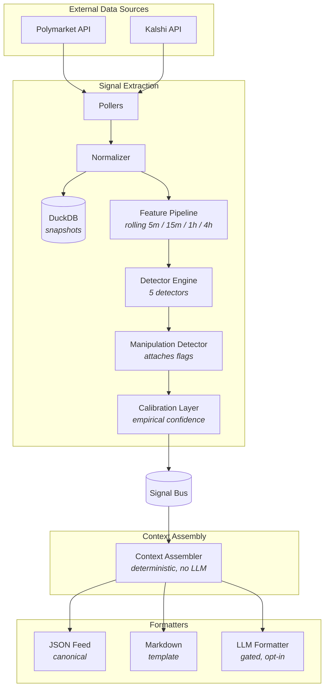

# Overview

## What

Augur is a two-layer system that watches a curated set of prediction markets on Polymarket and Kalshi, detects statistically significant changes in their microstructure, and emits structured events describing what changed and what context surrounds the change. The two layers are:

| Layer             | Function                                                                                                                                       | Output                                                                                                         |
| ----------------- | ---------------------------------------------------------------------------------------------------------------------------------------------- | -------------------------------------------------------------------------------------------------------------- |
| Signal Extraction | Polls market data, computes rolling features, runs five statistical detectors against bounded-domain models, and flags potential manipulation. | `MarketSignal` events with empirically calibrated confidence.                                                  |
| Context Assembly  | Looks up market metadata, related-market state from a curated taxonomy, and category-keyed investigation prompts.                              | `SignalContext` envelopes containing only verbatim facts and curated prompts — no synthesized causal language. |

A third, optional formatter can render a `SignalContext` into LLM-assisted prose for human-facing channels. This is gated, opt-in, and never substitutes for the structured contract. See `../architecture/system-design.md` and `../methodology/calibration-methodology.md` for the full mechanism.

## Why

Prediction markets aggregate dispersed information into prices. For markets that are deeply liquid and tied to anticipated events — Federal Reserve decisions, US elections, scheduled regulatory milestones, major crypto-asset filings — the price movement carries information that an attentive human or downstream agent can act on faster than reading the same conclusion from a news wire. Watching the raw price tape is noisy; the useful signal is in the derivative features (velocity, volume relative to baseline, cross-market consistency). Extracting those features continuously, calibrating their false-positive rates against a labeled corpus, and packaging the result as a structured event is the product Augur exists to deliver.

The scope is bounded. Augur addresses approximately 100 to 150 high-liquidity anticipated-event markets across Polymarket and Kalshi. It does not address the broader event universe, because most newsworthy events have no pre-existing market with sufficient depth. See `./non-goals.md` for the full list of what Augur does not cover.

## How

The signal extraction layer runs a polling loop at a per-market adaptive cadence (15 s to 300 s) and feeds normalized snapshots into a feature pipeline. Five detectors run against the feature stream:

- Price velocity, using Bayesian Online Changepoint Detection with a Beta-Binomial observation model appropriate for bounded probability series.
- Volume spike, using FDR-controlled thresholds tuned nightly against the prior 30 days of empirical labels.
- Order book imbalance, with a minimum-depth liquidity gate.
- Cross-market divergence, using Spearman rank correlation, Fisher-z transformation, and Benjamini-Hochberg correction across all taxonomy pairs.
- Regime shift, using two-sided CUSUM on rolling volatility with adaptive cooldown.

Every signal passes through a manipulation detector that attaches a `manipulation_flags` list (possibly empty). Confidence is calibrated empirically against a labeled `NewsworthyEvent` corpus, not derived from raw detector posteriors. No detector fires within six hours of market resolution.

The context assembler retrieves the market question, resolution criteria, and resolution source verbatim from the platform; lists related markets and their current state from a curated taxonomy; and returns a frozen list of investigation prompts keyed to the signal type and market category. Causal interpretation is the consumer's responsibility, not Augur's.

## Scope and Non-Goals

What Augur covers, what it does not, and which markets fall outside its design space are listed in `./non-goals.md`. Read that file before forming expectations about coverage.

## Architecture at a Glance

The full architecture is in `../architecture/system-design.md`. Storage and scaling decisions are in `../architecture/storage-and-scaling.md`. The polling state machine is in `../architecture/adaptive-polling-spec.md`. Signal merging under storms is in `../architecture/deduplication-and-storms.md`.
